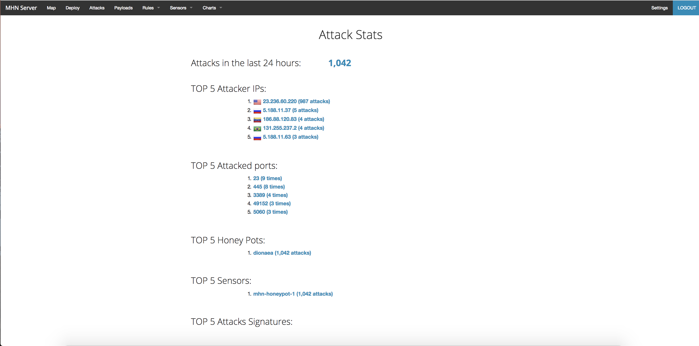
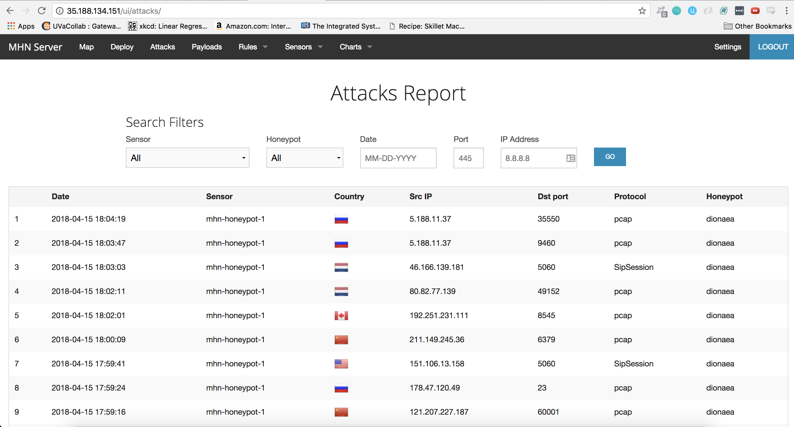

# CodePathWeek9-Honeypot

> Objective: Stand up a basic honeypot and demonstrate its effectiveness at detecting and/or collecting data about an attack.

## Details about Experiment

For this week's challenge, I deployed the first honeypot (mhn-honeypot-1). Most of the milestones were straightforward, but I ran into issues on Milestone 4 with finding the "deploy" button, after realizing this was located through accessing the external IP address of the mhn-admin through the browser. I also ran into issues with installing nmap. I installed it on my main terminal rather than my honeypot VM.

Summary of all my data collected:

